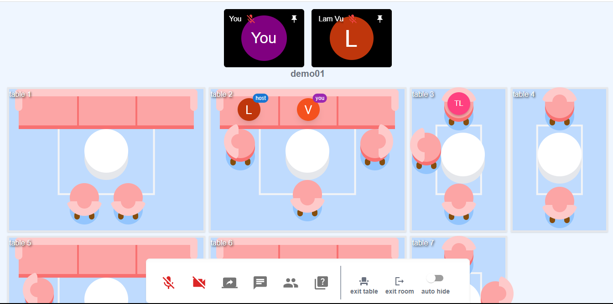
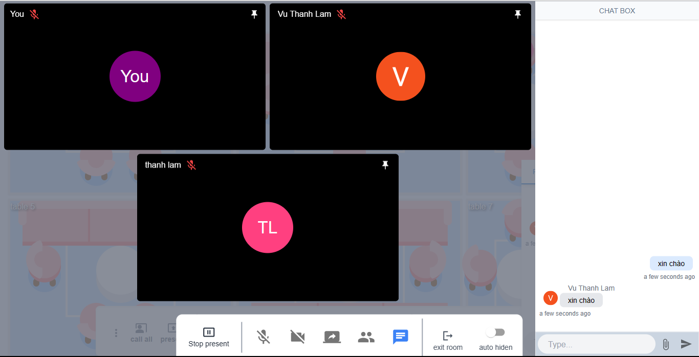

# KHOA ĐÀO TẠO CHẤT LƯỢNG CAO

# KHOÁ LUẬN TỐT NGHIỆP (HK 1 năm 2022-2023)

**Đề tài**: Xây dựng website họp nhóm trực tuyến \

**Công nghệ sử dụng**: MERN Stack

**Các chức năng chính**:

- Đăng ký, đăng nhập, chỉnh sửa profile
- Quản lý phòng họp
- Chat
- Sử dụng microphone, camera
- Thuyết trình
- ...

**Thành viên (hệ CLC Tieng Viet)**:

Lê Hoàng Nam 18110160

Vũ Thanh Lâm 18110142

**Thông tin liên lạc**:

Email: lehoangnam1201@gmail.com

FB: https://www.facebook.com/hoangnam22

**GVHD**: TS. Huỳnh Xuân Phụng

## GIỚI THIỆU
- Ứng dụng này là một nền tảng giao tiếp thời gian thực cho phép người dùng thực hiện các cuộc gọi như Zoom và Google Meet. Nhưng nó có giao diện thuận tiện giống như một cuộc họp thực sự với các bảng đại diện cho các nhóm, cho phép người dùng dễ dàng tương tác với các nhóm.

- Chủ phòng có thể trình bày cho cả phòng



## CÁCH CÀI ĐẶT

- clone project

```

git clone https://github.com/hoangnam1201/Web-meeting-online.git

```

### Database

- Có thể tải về từ https://docs.mongodb.com/manual/installation/
- Hoặc tải mongo container về sử dụng

```
docker pull mongo:latest
docker run --name mongodb -d -p 27017:27017 -v YOUR_LOCAL_DIR:/data/db mongo
```

- Thêm Role admin vào tài khoản:
- execu mongo container (sử dụng "docker ps" để xem danh sách container)

```
docker exec -i <CONTAINER ID> mongosh
```
- truy vấn update

```
use meetingdb
db.users.updateOne({email:"<USER EMAIL>"},{$set:{role:"ADMIN"}})
```

### BACK-END

- project backend nằm trong thư mục meetingbe

```
cd meetingBe
```

- khi mở file .env bạn sẽ thấy các thông tin \
  PORT= cổng chạy server api\
  SOCKET_PORT= cổng chạy server socket \
  HOST_DB= địa chỉ database \
  HOST_SERVER= địa chỉ domain của server be \
  HOST_FRONTEND= địa chỉ domain của server fe \
  CLIENT_ID= client id được google cung cấp dùng để đăng nhập bằng gmail \
  ACCESS_TOKEN_SECRET= mật khẩu access token \
  ACCESS_TOKEN_LIFE= thời gian sống access token \
  REFRESH_TOKEN_SECRET= mật khẩu refresh token \
  REFRESH_TOKEN_LIFE= thời gian sống refresh token \
  USER_EMAIL= tài khoản gmail \
  PASSWORD_EMAIL=mk gmail \
- Chạy các lệnh sau để run project ở local

```
npm install
npm start
```

- Nếu muốn build docker image thì chạy lênh sau

```
docker build -t <username>/<imagename>:<tag> .
```

- Run docker image

```
docker run -p 3002:3002 <username>/<imagename>:<tag>
```


### FRONT_END

- project backend nằm trong thư mục fe

```
cd fe
```
- khi mở file .env bạn sẽ thấy các thông tin \
  REACT_APP_CLIENT_ID= client id được google cung cấp dùng để đăng nhập bằng gmail \
  REACT_APP_HOST_BASE= địa chỉ server be \
  REACT_APP_HOST_NAME=tên domain của server be\
  REACT_APP_HOST_PORT=server api port\
  REACT_APP_SOCKET_HOST=server socket port\
  WDS_SOCKET_PORT = cổng kết nối tới server fe - không cần nếu chạy ở localhost\

- lệnh chạy ở local
```
npm install --legacy-peer-deps
npm start
```

- Nếu muốn build docker image thì chạy lênh sau

```
docker build -t <username>/<imagename>:<tag> .
```

- Run docker image

```
docker run -p 3000:3000 <username>/<imagename>:<tag>
```

## CÁCH DEPLOY LÊN EC2 AWS

### khởi chạy container
- ở project truy cập file docker-compose
- Bạn sẻ thấy các biến environment tương tự ở trên (Cách cài đặt)
- Điều chỉnh cho phù hợp
- khởi chạy docker-compose bằng lệnh

```
docker compose up .
```

### cài đặt và cấu hình nginx

Install and enable NGINX

```
sudo apt install nginx -y
sudo systemctl enable nginx
```

Di chuyển đến '/etc/nginx/sites-available'

```
cd /etc/nginx/sites-available
```

Copy file default sang một file mới

```
sudo cp default utemeeting
```

ghi nội dung sau vào file utemeeting

```
server {
        listen 80;
        listen [::]:80;

        server_name utemeeting.online www.utemeeting.online;

        location / {
            proxy_pass http://localhost:3000;
            proxy_http_version 1.1;
            proxy_set_header Upgrade $http_upgrade;
            proxy_set_header Connection 'upgrade';
            proxy_set_header Host $host;
            proxy_cache_bypass $http_upgrade;
        }

         location /api {
            proxy_pass http://<backendAddress>:3002;
            proxy_http_version 1.1;
            proxy_set_header Upgrade $http_upgrade;
            proxy_set_header Connection 'upgrade';
            proxy_set_header Host $host;
            proxy_cache_bypass $http_upgrade;
        }

         location /peerjs {
            proxy_pass http://<backendAddress>:3002;
            proxy_http_version 1.1;
            proxy_set_header Upgrade $http_upgrade;
            proxy_set_header Connection 'upgrade';
            proxy_set_header Host $host;
            proxy_cache_bypass $http_upgrade;
        }

         location /socket.io {
            proxy_pass http://<backendAddress>:3003;
            proxy_http_version 1.1;
            proxy_set_header Upgrade $http_upgrade;
            proxy_set_header Connection 'upgrade';
            proxy_set_header Host $host;
            proxy_cache_bypass $http_upgrade;
        }
}
```

khởi động lại nginx

```
sudo rm /etc/nginx/sites-enabled/default
sudo ln -s /etc/nginx/sites-available/utemeeting /etc/nginx/sites-enabled/
systemctl restart nginx
```

#### Enable Firewall

```
sudo ufw status
sudo ufw allow ssh
sudo ufw allow http
sudo ufw allow https
sudo ufw enable
sudo ufw status
```

#### Enable SSL bằng Encrypt

Install

```
sudo snap install --classic certbot
sudo ln -s /snap/bin/certbot /usr/bin/certbot
```

Cài đặt tính chỉ

```
sudo certbot --nginx
```
